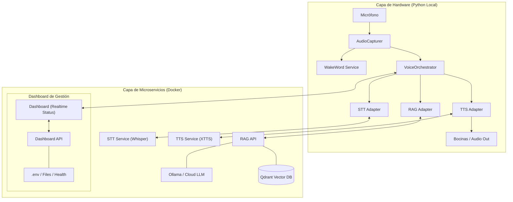

# Arquitectura del Sistema - KodaVox

Este documento detalla la estructura técnica, flujo de datos y patrones de diseño utilizados en el proyecto.

## 1. Visión General
El sistema está diseñado bajo una arquitectura de **Microservicios Híbridos**. Combina la potencia de contenedores Docker para tareas pesadas de IA con un orquestador local en Python para el manejo de hardware de audio en tiempo real.

### Diagrama de Arquitectura de Alto Nivel

---

## 2. Tecnologías Utilizadas

### Capa de IA (Docker)
- **STT**: `faster-whisper` (FastAPI) para transcripción ultra-rápida.
- **TTS**: `Coqui XTTS-v2` para clonación de voz de alta fidelidad.
- **RAG Engine**: `LangChain` / `Qdrant` para búsqueda semántica.
- **LLMs**: `Ollama` (Local), `OpenAI` o `Gemini` (Seleccionables).
- **Vector DB**: `Qdrant` para almacenamiento de embeddings.

### Capa de Orquestación (Python)
- **Audio**: `PyAudio` para captura y reproducción.
- **Wake Word**: `OpenWakeWord` (detección local eficiente).
- **Communication**: `Socket.IO` (EventBus) y `httpx` / `requests`.

### Dashboard de Gestión
- **Frontend**: `React`, `Vite`, `Tailwind CSS 4`, `Framer Motion`.
- **Backend**: `FastAPI`, `python-dotenv`.

---

## 3. Patrones de Diseño

1.  **Event-Driven Architecture (EDA)**:
    - Se utiliza un `EventBus` basado en Socket.IO para desacoplar los módulos. El orquestador no llama directamente a las funciones, sino que emite y reacciona a eventos como `audio_chunk`, `wakeword_detected` o `transcription_final`.
2.  **Adapter Pattern**:
    - Cada microservicio externo tiene un `Adapter` en el orquestador. Esto permite cambiar el servicio (ej. de Whisper local a Google STT) sin tocar la lógica central del orquestador.
3.  **State Machine**:
    - El `StateManager` maneja los estados globales (`IDLE`, `LISTENING`, `PROCESSING`, `SPEAKING`), asegurando que solo se procese audio en los momentos adecuados.
4.  **Observer Pattern**:
    - El Dashboard actúa como un observador del `EventBus`, visualizando cambios de estado y logs en tiempo real.

---

## 4. Requisitos de Hardware (PC Specs)

| Componente | Mínimo (Funcional) | Recomendado (Premium) |
| :--- | :--- | :--- |
| **CPU** | 4 Cores (i5/Ryzen 5) | 8+ Cores (i7/Ryzen 7) |
| **RAM** | 16 GB | 32 GB |
| **GPU** | No requerida (Lento) | NVIDIA RTX 3060+ (8GB+ VRAM) |
| **Almacenamiento** | 20 GB libres (SSD) | 50 GB libres (NVMe) |
| **S.O.** | Windows 10/11 | Windows 10/11 + WSL2 |

---

## 5. Perfil de Desarrollador Requerido
Para mantener o extender este sistema, se requiere conocimiento en:
- **Backend**: Python Avanzado, FastAPI, PyAudio.
- **DevOps**: Docker & Docker Compose, gestión de variables de entorno.
- **IA/ML**: NLP, RAG, conocimientos básicos de Embeddings y LLMs.
- **Frontend**: React (Hooks), Tailwind CSS, WebSockets.

---

## 6. Documentación de Módulos

### `orchestrator/`
El cerebro del sistema. Maneja la captura física de audio y la coordinación de eventos. Implementa el flujo de vida del asistente.

### `services/stt/`
Microservicio encargado de convertir audio en texto. Optimizado con `faster-whisper`. Soporta WebSockets para baja latencia.

### `services/tts/`
Motor de voz. Utiliza XTTS-v2 para clonación instantánea. Requiere GPU para ser realmente fluido en streaming.

### `services/rag/`
Inteligencia documental. Procesa tus archivos y consulta al LLM seleccionado. Mantiene la "memoria" del conocimiento específico.

### `dashboard/`
La cara del proyecto. Permite configurar API Keys, gestionar archivos RAG, seleccionar voces y ver el estado de salud de todos los contenedores.
