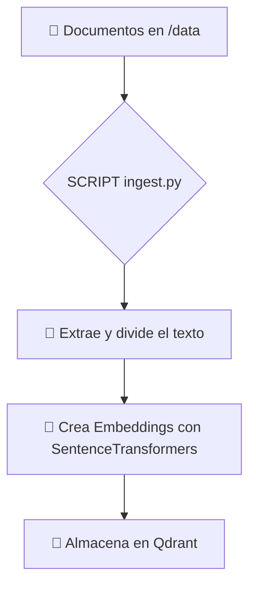

# RAG Qwen Starter

Este proyecto es una implementación de un sistema de **Generación Aumentada por Recuperación (RAG)**, diseñado para ejecutarse localmente. Permite hacer preguntas en lenguaje natural sobre una base de documentos privados y obtener respuestas generadas por un Modelo de Lenguaje Grande (LLM) sin que tus datos salgan de tu máquina.

## Puntos Clave
- **Privacidad:** Todo el proceso, desde el almacenamiento de documentos hasta la generación de respuestas, se ejecuta en contenedores Docker locales.
- **Modularidad:** Utiliza servicios desacoplados (FastAPI, Qdrant, Ollama) orquestados con `docker-compose`.
- **Extensibilidad:** Fácil de adaptar para soportar nuevos tipos de documentos o diferentes modelos de lenguaje.
- **Fácil de usar:** Con Docker, la configuración y ejecución se simplifican a unos pocos comandos.

---

## Diagrama de Funcionamiento

El sistema se compone de dos flujos principales: la ingesta de datos y la resolución de consultas.

### 1. Flujo de Ingesta de Datos


### 2. Flujo de Consulta y Respuesta
```mermaid
flowchart TD
    subgraph Usuario
        A[👨‍💻 Usuario]
    end

    subgraph "Servidor Local"
        B[🌐 API FastAPI]
        C[🧠 Embedding de la consulta]
        D[🔍 Búsqueda de Similitud en Qdrant]
        E[📝 Prompt Aumentado]
        F[🤖 LLM Local con Ollama]
        G[💾 Vector DB (Qdrant)]
    end

    A -- 1. Envía Pregunta --> B;
    B -- 2. Genera Embedding --> C;
    C -- 3. Busca Contexto --> G;
    G -- 4. Devuelve Contexto --> D;
    D -- 5. Ensambla Prompt --> E;
    E -- 6. Envía a LLM --> F;
    F -- 7. Genera Respuesta --> B;
    B -- 8. Devuelve Respuesta --> A;

```

---

## Características Principales

- **Backend con FastAPI:** Una API robusta y rápida para gestionar las solicitudes.
- **Vector Database con Qdrant:** Almacenamiento y búsqueda de vectores de alta eficiencia.
- **LLM Local con Ollama:** Soporte para ejecutar modelos de lenguaje como Mistral, Llama, etc., de forma local, con aceleración de GPU configurada.
- **Ingesta de Documentos:** Scripts para procesar archivos (actualmente `.md`, pero extensible a `.pdf`, `.docx` etc.) y poblarlos en la base de datos de vectores.
- **Orquestación con Docker Compose:** Definición clara de los servicios, redes y volúmenes para una fácil gestión.

---

## Requisitos y Sistema Recomendado

### Software
- **Sistema Operativo:** Linux, macOS, o Windows (con WSL2 para un mejor rendimiento de Docker).
- **Docker:** Versión 20.10 o superior.
- **Docker Compose:** Versión 1.29 o superior.
- **Git:** Para clonar el repositorio.

### Hardware (Recomendado)
- **CPU:** 8 núcleos o más.
- **RAM:** 16 GB o más (el LLM consume una cantidad significativa de memoria).
- **GPU:** Una GPU NVIDIA con al menos 8 GB de VRAM es **altamente recomendada** para una inferencia rápida del LLM. Es necesario tener los drivers de NVIDIA y el `nvidia-container-toolkit` instalados.
- **Almacenamiento:** Al menos 20 GB de espacio libre para los modelos, imágenes de Docker y la base de datos de vectores.

---

## Instalación y Ejecución

1.  **Clona el repositorio:**
    ```bash
    git clone <URL-DEL-REPOSITORIO>
    cd rag-qwen-starter
    ```

2.  **Añade tus documentos:**
    Coloca los archivos que deseas consultar en el directorio `data/`.

3.  **Levanta los servicios:**
    Este comando descargará las imágenes necesarias, construirá el contenedor de la aplicación y ejecutará todo en segundo plano.
    ```bash
    docker-compose up -d
    ```

4.  **Ejecuta la ingesta de datos:**
    Este comando ejecuta el script `ingest.py` dentro del contenedor de la API para procesar tus documentos y almacenarlos en Qdrant.
    ```bash
    docker-compose exec fastapi python ingest.py
    ```

5.  **Realiza una consulta:**
    Una vez que la ingesta ha terminado, puedes hacer preguntas a la API usando `curl` o cualquier cliente HTTP.
    ```bash
    curl -X POST http://localhost:8000/ask \
    -H "Content-Type: application/json" \
    -d '{"query": "resume la trama de la película WALL-E"}'
    ```

    Deberías recibir una respuesta en formato JSON con la contestación del modelo.

---

## Estructura del Proyecto

```
.
├── app/                  # Contiene la aplicación FastAPI y el script de ingesta.
│   ├── Dockerfile        # Define el contenedor de la aplicación.
│   ├── ingest.py         # Script para procesar y almacenar documentos.
│   ├── main.py           # Lógica principal de la API FastAPI.
│   └── requirements.txt  # Dependencias de Python.
├── data/                 # Directorio para tus documentos fuente.
├── ollama/               # Volumen persistente para los modelos de Ollama.
├── qdrant_storage/       # Volumen persistente para la base de datos de Qdrant.
└── docker-compose.yml    # Orquesta todos los servicios.
```
