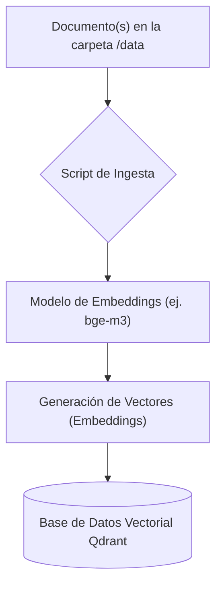
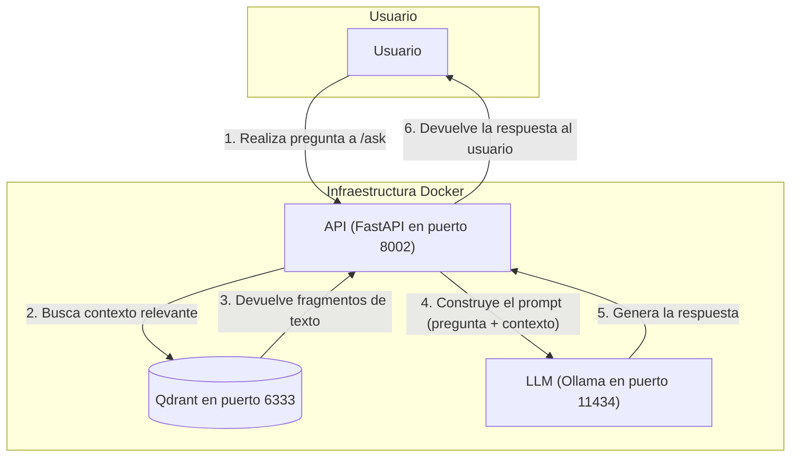

# Proyecto RAG con Docker, Ollama y Qdrant

Este proyecto implementa un sistema completo de **Generación Aumentada por Recuperación (RAG)** que se ejecuta localmente utilizando Docker. Permite "chatear" con tus propios documentos obteniendo respuestas de un Modelo de Lenguaje Grande (LLM) que se basa únicamente en la información proporcionada.

## Arquitectura

El sistema está orquestado con `docker-compose` y consta de tres servicios principales:

1.  **`qdrant`**: Una base de datos vectorial de alto rendimiento que almacena los documentos y permite búsquedas semánticas eficientes.
2.  **`ollama`**: Un servidor que ejecuta modelos de lenguaje grandes (como Qwen o Llama) de forma local, con soporte para aceleración por GPU.
3.  **`fastapi`**: Una aplicación Python que sirve como el núcleo del sistema, manejando la lógica de ingesta de datos y orquestando el flujo de RAG a través de una API.

---

## Diagramas de Flujo

### Flujo de Ingesta de Datos

Este diagrama muestra cómo los documentos son procesados y almacenados en la base de datos vectorial.



### Flujo de Consulta (RAG)

Este diagrama ilustra cómo el sistema responde a una pregunta del usuario.



---

## Puesta en Marcha y Uso

### Prerrequisitos
*   Docker
*   Docker Compose
*   (Opcional) Una GPU NVIDIA con los drivers correspondientes para acelerar Ollama.

### Pasos

1.  **Clonar el repositorio:**
    ```bash
    git clone <url-del-repositorio>
    cd <nombre-del-repositorio>
    ```

2.  **Iniciar los servicios:**
    Ejecuta el siguiente comando en la raíz del proyecto. La primera vez, Docker Compose construirá la imagen de la aplicación y Ollama podría tardar un tiempo en descargar el modelo de lenguaje si no está en caché.
    ```bash
    docker-compose up --build -d
    ```

3.  **Interactuar con la API:**
    *   La API estará disponible en `http://localhost:8000`.
    *   Puedes ver la documentación interactiva de FastAPI y probar los endpoints en `http://localhost:8000/docs`.
    *   Normalmente, primero necesitarás llamar a un endpoint de ingesta (ej. `/ingest`) para procesar los documentos en la carpeta `/data`.
    *   Luego, puedes usar el endpoint de consulta (ej. `/query`) para hacer preguntas.

4.  **Detener los servicios:**
    ```bash
    docker-compose down
    ```
